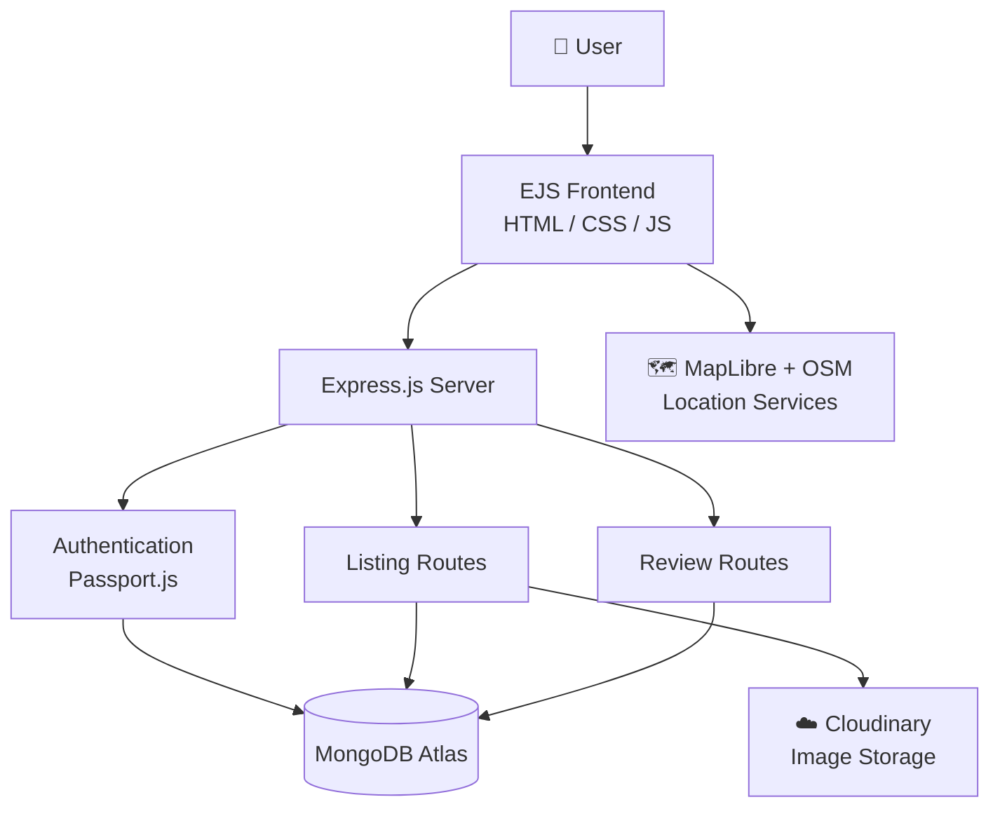
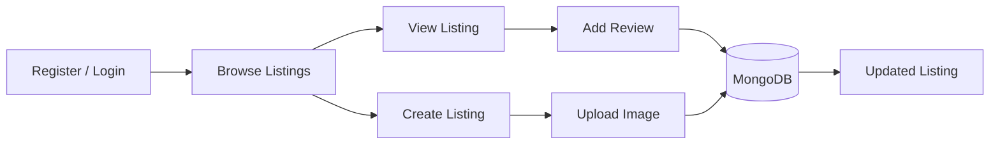

<div align="center">

# 🏡 Wonderlust

### A Full-Stack Travel & Property Listing Platform

Discover, list, and review travel accommodations with secure authentication, cloud image uploads, and interactive maps.

[](https://wonderlust-majorproject.onrender.com/)
[](https://github.com/Harishmajjevadimatha/Wonderlust-_MajorProject)

</div>

---

## 📑 Table of Contents

- [About the Project](#-about-the-project)
- [Features](#-features)
- [Tech Stack](#-tech-stack)
- [Architecture](#-architecture)
- [Project Structure](#-project-structure)
- [Getting Started](#-getting-started)
- [Environment Variables](#-environment-variables)
- [Data Models](#-data-models)
- [Application Routes](#-application-routes)
- [Map Integration](#-map-integration)
- [Deployment](#-deployment)
- [Roadmap](#-roadmap)
- [Contributing](#-contributing)
- [License](#-license)
- [Author](#-author)

---

## 📖 About the Project

**Wonderlust** is a full-stack web application where users can explore travel accommodations, publish their own property listings, and share reviews and ratings. It follows the MVC pattern and combines session-based authentication, cloud image storage, and open-source map services into a complete, production-deployed platform.

**Highlights**

- Full CRUD for property listings with owner-based authorization
- Secure authentication using Passport.js and persistent MongoDB-backed sessions
- Image uploads handled through Cloudinary
- Interactive maps built entirely on open-source tools, with no paid Mapbox dependency
- Responsive interface that works across desktop, tablet, and mobile

---

## ✨ Features

| Category | Capabilities |
| --- | --- |
| 🔐 **Authentication** | User registration, login and logout, secure session handling, protected routes |
| 🏠 **Listings** | Browse, create, edit, delete, and view detailed property pages |
| 🖼️ **Image Upload** | Upload property images, stored on Cloudinary |
| ⭐ **Reviews & Ratings** | Add reviews and star ratings, view reviews per listing, delete own reviews |
| 🗺️ **Maps** | Interactive location map on each listing powered by MapLibre GL JS and OpenStreetMap |
| 🛡️ **Authorization** | Only owners can modify listings; only authors can delete their reviews |
| 💬 **Flash Messages** | Clear success and error feedback after every action |
| 📱 **Responsive UI** | Bootstrap-based layout that adapts to all screen sizes |

---

## 🛠️ Tech Stack

| Layer | Technologies |
| --- | --- |
| **Frontend** | HTML5, CSS3, JavaScript, EJS, EJS-Mate, Bootstrap |
| **Backend** | Node.js, Express.js |
| **Database** | MongoDB, Mongoose |
| **Auth & Sessions** | Passport.js (Local Strategy), Express Session, Connect-Mongo |
| **Image Management** | Cloudinary, Multer, Multer Storage Cloudinary |
| **Maps & Geocoding** | MapLibre GL JS, OpenStreetMap, Nominatim API |
| **Deployment** | Render, MongoDB Atlas, GitHub |

---

## 🏗️ Architecture



### Main Application Flow



---

## 📂 Project Structure

```text
Wonderlust-_MajorProject/
├── controllers/        # Request handling logic
├── models/             # Mongoose schemas
│   ├── listing.js
│   ├── review.js
│   └── user.js
├── routes/             # Express route definitions
│   ├── listing.js
│   ├── review.js
│   └── user.js
├── views/              # EJS templates
│   ├── layouts/
│   ├── listings/
│   ├── users/
│   └── includes/
├── public/             # Static assets
│   ├── css/
│   ├── js/
│   └── images/
├── utils/              # Helper utilities
├── app.js              # Application entry point
├── schema.js           # Validation schemas
├── package.json
└── README.md
```

---

## 🚀 Getting Started

### Prerequisites

- [Node.js](https://nodejs.org/) v16 or higher
- A [MongoDB Atlas](https://www.mongodb.com/atlas) cluster (or a local MongoDB instance)
- A [Cloudinary](https://cloudinary.com/) account

### Installation

**1. Clone the repository**

```bash
git clone https://github.com/Harishmajjevadimatha/Wonderlust-_MajorProject.git
cd Wonderlust-_MajorProject
```

**2. Install dependencies**

```bash
npm install
```

**3. Configure environment variables**

Create a `.env` file in the project root (see [Environment Variables](#-environment-variables)).

**4. Start the application**

```bash
npm start
```

or

```bash
node app.js
```

The app will be available at **http://localhost:8080**.

---

## 🔐 Environment Variables

Create a `.env` file in the root directory:

```env
ATLASDB_URL=your_mongodb_atlas_connection_string
SECRET=your_session_secret

CLOUDINARY_CLOUD_NAME=your_cloudinary_cloud_name
CLOUDINARY_KEY=your_cloudinary_api_key
CLOUDINARY_SECRET=your_cloudinary_api_secret
```

| Variable | Description |
| --- | --- |
| `ATLASDB_URL` | MongoDB Atlas connection string |
| `SECRET` | Secret used to sign Express sessions |
| `CLOUDINARY_CLOUD_NAME` | Cloudinary cloud name |
| `CLOUDINARY_KEY` | Cloudinary API key |
| `CLOUDINARY_SECRET` | Cloudinary API secret |

> ⚠️ **Never commit your `.env` file.** Make sure it is listed in `.gitignore`.

---

## 🗃️ Data Models

| Model | Fields |
| --- | --- |
| **User** | Username, email, hashed credentials (managed by Passport-Local-Mongoose) |
| **Listing** | Title, description, price, location, country, image, owner, reviews |
| **Review** | Rating, comment, author, associated listing |

---

## 🧭 Application Routes

| Method | Route | Description | Auth Required |
| --- | --- | --- | :---: |
| `GET` | `/listings` | View all listings | ❌ |
| `GET` | `/listings/new` | New listing form | ✅ |
| `POST` | `/listings` | Create a listing | ✅ |
| `GET` | `/listings/:id` | View listing details | ❌ |
| `GET` | `/listings/:id/edit` | Edit listing form | ✅ Owner |
| `PUT` | `/listings/:id` | Update a listing | ✅ Owner |
| `DELETE` | `/listings/:id` | Delete a listing | ✅ Owner |
| `POST` | `/listings/:id/reviews` | Add a review | ✅ |
| `DELETE` | `/listings/:id/reviews/:reviewId` | Delete a review | ✅ Author |
| `GET/POST` | `/signup` | Register | ❌ |
| `GET/POST` | `/login` | Log in | ❌ |
| `GET` | `/logout` | Log out | ✅ |

> Routes shown reflect the standard RESTful structure; adjust to match your implementation.

---

## 🗺️ Map Integration

Wonderlust displays property locations on an interactive map using fully open-source tooling:

- **MapLibre GL JS** for map rendering
- **OpenStreetMap** for map tiles and data
- **Nominatim** for geocoding addresses into coordinates

This removes any dependency on paid Mapbox services.

---

## ☁️ Deployment

| Component | Service |
| --- | --- |
| Web application | [Render](https://render.com/) |
| Database | [MongoDB Atlas](https://www.mongodb.com/atlas) |
| Image storage | [Cloudinary](https://cloudinary.com/) |

**Live:** https://wonderlust-majorproject.onrender.com/

> ℹ️ Hosted on a free tier, so the first request after inactivity may take a few seconds to wake the server.

---

## 🔮 Roadmap

- [ ] 🔎 Advanced property search and filtering
- [ ] ❤️ Wishlist / favorites
- [ ] 💳 Online booking and payment integration
- [ ] 📧 Email notifications
- [ ] 🌦️ Weather information for destinations
- [ ] 📱 Progressive Web App (PWA) support
- [ ] 🤖 AI-powered travel recommendations
- [ ] 🧭 Advanced location-based search

---

## 🤝 Contributing

Contributions, issues, and feature requests are welcome.

1. Fork the repository
2. Create a feature branch: `git checkout -b feature/your-feature`
3. Commit your changes: `git commit -m "Add your feature"`
4. Push to the branch: `git push origin feature/your-feature`
5. Open a Pull Request

---

## 📄 License

This project was developed as an academic and portfolio project.

© 2026 Wonderlust. All rights reserved.

---

## 👤 Author

**Harish Majjevadimatha**

- GitHub: [@Harishmajjevadimatha](https://github.com/Harishmajjevadimatha)

<div align="center">

⭐ If you found this project useful, consider giving it a star!

</div>
